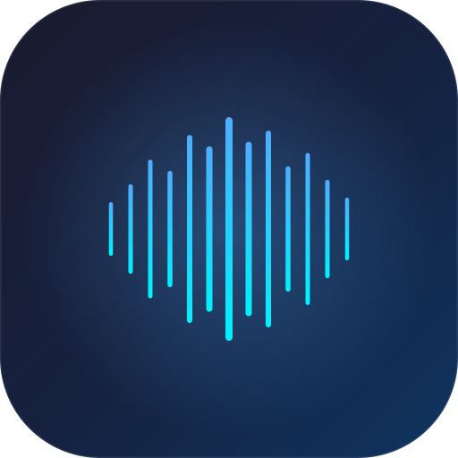

# Awesome Audio

A native macOS app that processes podcast and voiceover audio to broadcast quality — offline, no subscriptions, no uploads.



## What It Does

Drop in a raw recording, get back broadcast-ready audio. Awesome Audio applies a professional processing chain:

1. **High-pass filter** — removes low-frequency rumble (HVAC, mic handling, traffic)
2. **ML noise reduction** — DeepFilterNet removes background noise without artifacts
3. **De-essing** — reduces harsh sibilance ("s" sounds) naturally
4. **Compression** — evens out dynamics (quiet parts audible, loud parts controlled)
5. **Loudness normalization** — hits podcast (-16 LUFS) or YouTube (-14 LUFS) standards
6. **True peak limiting** — prevents clipping with BS.1770-compliant limiting

### Before & After

Your raw recording → broadcast-ready audio in one click. No audio engineering expertise required.

## Features

- **Drag and drop** — WAV, MP3, M4A, AIFF input
- **4 built-in presets** — Podcast Standard, YouTube, Noisy Environment, Minimal
- **Custom presets** — save your own processing settings
- **Before/after comparison** — see LUFS and true peak measurements
- **Export as WAV** — 16-bit (with TPDF dithering) or 24-bit output
- **Fully offline** — no internet, no cloud, no subscription
- **Native macOS** — SwiftUI, light/dark mode, SF Symbols

## Requirements

- macOS 14 (Sonoma) or later
- Apple Silicon or Intel Mac
- Rust toolchain (for building DeepFilterNet from source)

## Building

### Prerequisites

```bash
# Install Rust (if not already installed)
curl --proto '=https' --tlsv1.2 -sSf https://sh.rustup.rs | sh
rustup target add x86_64-apple-darwin

# Install XcodeGen
brew install xcodegen
```

### Build DeepFilterNet

```bash
cd vendor/deepfilternet
./build-universal.sh
```

This builds the DeepFilterNet noise reduction engine as a universal static library (arm64 + x86_64).

### Generate Xcode Project & Build

```bash
xcodegen generate
open AwesomeAudio.xcodeproj
```

Then build and run in Xcode (Cmd+R).

### SPM Build (library only, no DeepFilterNet)

```bash
swift build
swift test  # 57 tests
```

## Architecture

Two-pass offline processing pipeline:

```
Input (WAV/MP3/M4A/AIFF)
  → Decode → Resample (48kHz) → Downmix (mono)
  → Pass 1: HPF → DeepFilterNet → De-ess → Compress → Measure LUFS
  → Pass 2: Gain normalize → True peak limit → Write WAV
  → Post-verify: Re-measure final LUFS
Output (mono WAV, 16/24-bit)
```

### Tech Stack

| Component | Technology |
|---|---|
| UI | SwiftUI (macOS 14+) |
| Noise Reduction | [DeepFilterNet](https://github.com/Rikorose/DeepFilterNet) v0.5.6 (Rust, C API) |
| DSP | Accelerate/vDSP |
| Loudness | libebur128 (EBU R128) |
| Waveform | DSWaveformImage |

### Processing Chain

| Stage | Type | Implementation |
|---|---|---|
| High-Pass Filter | Butterworth biquad | vDSP.Biquad, 80Hz default |
| Noise Reduction | ML-based | DeepFilterNet C API |
| De-esser | Split-band dynamic EQ | 6.5kHz sidechain, max -6dB |
| Compressor | Feed-forward, soft knee | 3ms lookahead, auto makeup |
| LUFS Measurement | EBU R128 | libebur128 |
| Gain Normalization | Linear gain | LUFS-derived offset |
| True Peak Limiter | 4x oversampling FIR | BS.1770, -1.0 dBTP ceiling |

## Testing

57 tests across 10 suites covering all DSP processors, data models, format adapter, and temp file management.

```bash
swift test
```

## License

MIT

## Credits

- [DeepFilterNet](https://github.com/Rikorose/DeepFilterNet) by Hendrik Schroeter (MIT/Apache-2.0)
- [libebur128](https://github.com/jiixyj/libebur128) (MIT)
- [DSWaveformImage](https://github.com/dmrschmidt/DSWaveformImage) (MIT)
